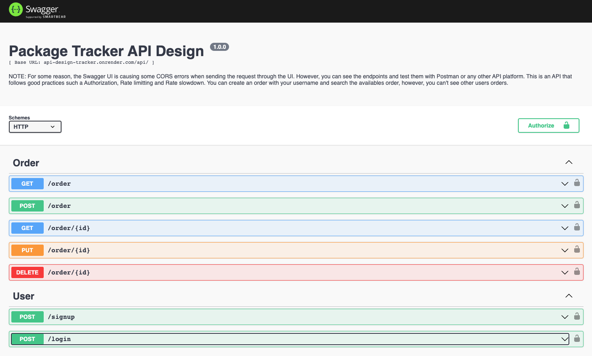

# Package Tracker API Design

## API

Available endpoints:

Base URL: `api-design-tracker.onrender.com/api/`

- GET `/order`: Get all the orders associate with the user.
- POST `/order`: Creates a random order for the user.
- GET `/order/:id`: Get a specific order by the order id. 
- PUT `/order/:id`: Edits the brand or equipment of a specific order by the order id. 
- DELETE `/order/:id`: Deletes a specific order by the order id. 
>
- POST `/signup`: Create an account and generates a JWT.
- POST `/login`: Authenticate the user. 

